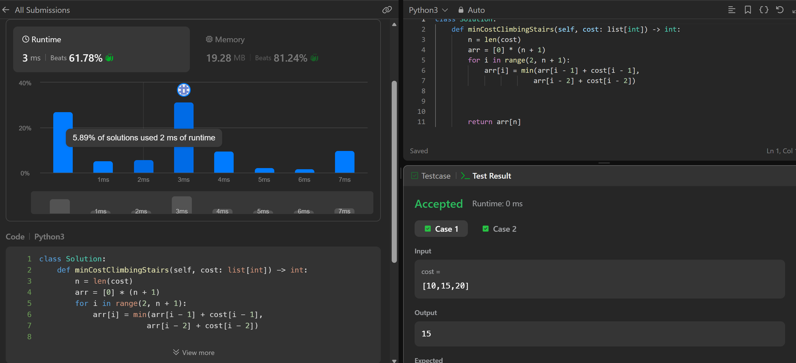
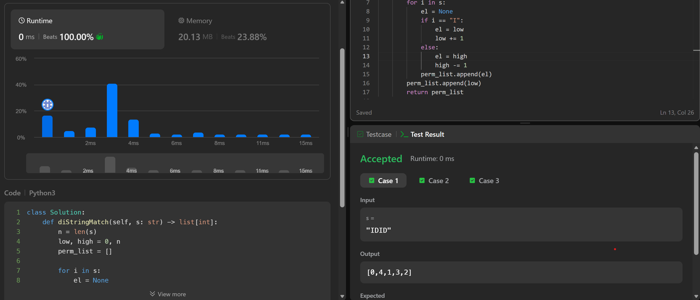
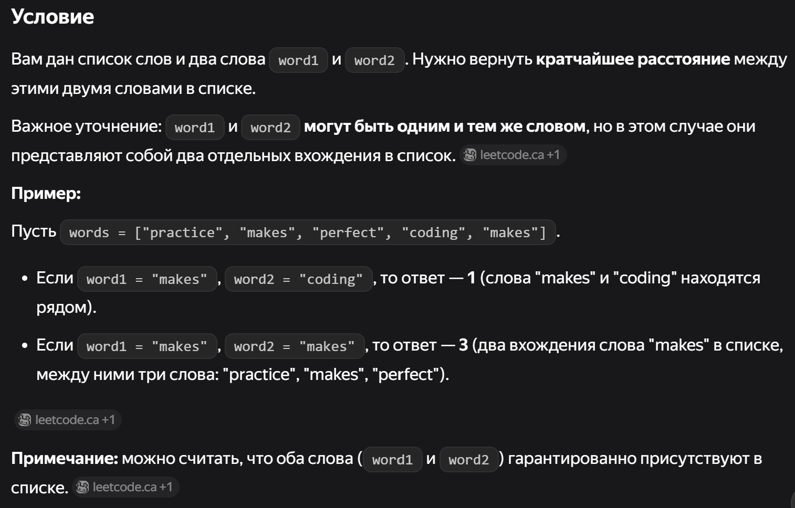

# PYTHON-practice
- 61-746 - 61 variant, leetcode.com 746
> You are given an integer array cost where cost[i] is the cost of ith step on a staircase.
Once you pay the cost, you can either climb one or two steps.
You can either start from the step with index 0, or the step with index 1.
Return the minimum cost to reach the top of the staircase, which is the position just past the last step (index cost.length). 

- 61-942 - leetcode.com 942
> A permutation perm of n + 1 integers of all the integers in the range [0, n] can be represented as a string s of length n where:
s[i] == 'I' if perm[i] < perm[i + 1], and
s[i] == 'D' if perm[i] > perm[i + 1].
Given a string s, reconstruct the permutation perm and return it. If there are multiple valid permutations perm, return any of them. 

- 61-245 - leetcode 245
> Given a list of words and two words word1 and word2, return the shortest distance between these two words in the list.
word1 and word2 may be the same and they represent two individual words in the list.
Example:
Assume that words = ["practice", "makes", "perfect", "coding", "makes"].
Input: word1 = “makes”, word2 = “coding”
Output: 1
Input: word1 = "makes", word2 = "makes"
Output: 3
Note:
You may assume word1 and word2 are both in the list.
